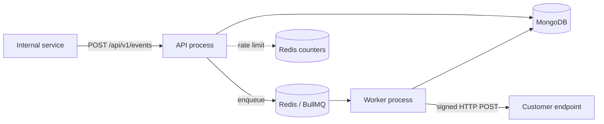
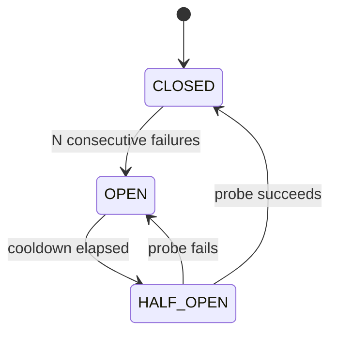
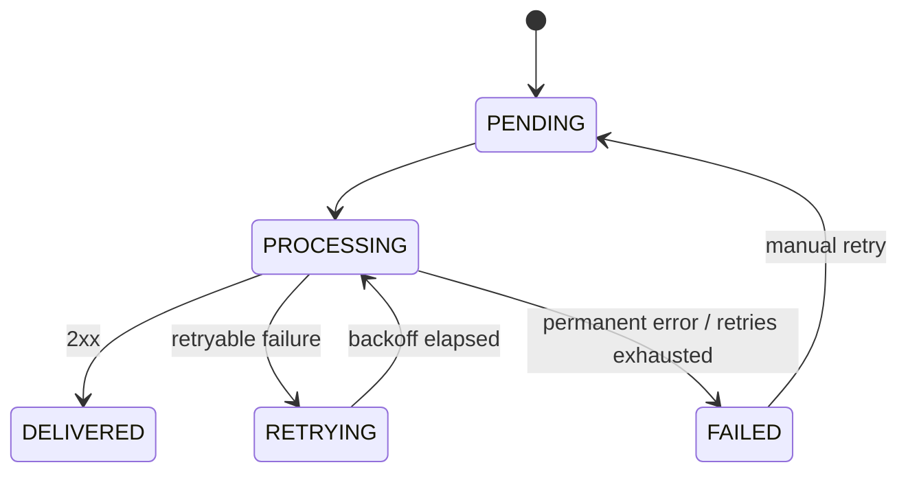

# RelayCore

A multi-tenant webhook delivery service. Internal services send events to RelayCore, and RelayCore delivers them reliably to each customer's webhook endpoint: signed, retried, rate limited and fully tracked.

**Stack:** Node.js · TypeScript · Express · MongoDB (Mongoose) · Redis · BullMQ · Vitest · GitHub Actions

> **Status:** early development. Phase 0 (project setup) is complete. See the [roadmap](#roadmap).

---

## Why this exists

Calling a customer's server from your request path is fragile: their server can be slow, down or wrong. RelayCore accepts the event immediately (`202`) and delivers it in the background, with the guarantees a webhook sender needs:

- **Tenant isolation:** one customer can never see or affect another's data
- **Signed payloads:** receivers can verify authenticity and reject replays
- **Retries with backoff:** temporary failures heal on their own
- **Circuit breaker:** dead endpoints stop wasting worker capacity
- **Dead letters + manual retry:** nothing silently disappears
- **Delivery tracking:** every attempt is inspectable without reading logs

## Architecture



Two processes, one codebase:

| Process | Entry | Job |
|---|---|---|
| **API** | `src/server.ts` | Authenticate tenant, rate limit, validate, store event, create deliveries, enqueue, return `202`. Never calls customer servers. |
| **Worker** | `src/worker.ts` | Pick up delivery jobs, sign, POST to the endpoint, record the result, retry or fail. Scales independently. |

### Request flow

1. Internal service calls `POST /api/v1/events`.
2. API authenticates the tenant and checks the Redis rate limit.
3. API saves the `Event`, finds matching active endpoints, creates one `Delivery` (`PENDING`) per endpoint and enqueues a job for each.
4. API returns `202 Accepted` immediately.
5. Worker loads the delivery, checks the endpoint's circuit breaker, signs the payload and sends the request.
6. Worker records the outcome: delivered, retrying or failed.

## Core concepts

### Multi-tenancy
Every request belongs to a tenant, identified by API key (only a hash is stored). Every database query and Redis key includes the tenant ID, never just a document ID, so tenants stay isolated.

### Rate limiting
Redis counters limit events per tenant per time window (default 500/min, configurable per tenant). One noisy tenant cannot consume all API capacity. Over the limit returns `429` with `Retry-After`.

### Webhook signatures
Each endpoint has its own secret. The worker signs `timestamp.body` with HMAC-SHA256 and sends:

```
X-Relay-Signature: t=1786651200,v1=9f82ab...
```

Receivers recompute the HMAC with their secret and compare in constant time. They should also reject old timestamps (default tolerance 5 minutes) to prevent replay attacks. Reference implementation: [`src/lib/signature.ts`](src/lib/signature.ts).

### Retries
Temporary failures are retried with exponential backoff and jitter: **5s → 25s → 2m → 10m → 1h**.

| Outcome | Action |
|---|---|
| 2xx | `DELIVERED` |
| Timeout, connection error, 408, 429, 5xx | Retry |
| 400, 401, 403, 404 and other 4xx | `FAILED` immediately (configuration problem, retrying won't help) |
| Retries exhausted | `FAILED` (dead letter) |

Delivery is **at-least-once**: a receiver may get the same event twice, so receivers should be idempotent (every payload carries a stable event `id`). Rules live in [`src/lib/retry.ts`](src/lib/retry.ts).

### Circuit breaker
Per endpoint, so a dead customer server doesn't tie up workers.



While `OPEN`, deliveries are delayed instead of attempted, and don't consume retry attempts.

### Delivery lifecycle



# What is RelayCore?

**RelayCore is a post office for notifications between servers.** Your system says "something happened", and RelayCore makes sure the right customers get told, reliably, even when things go wrong.

## The problem, with a story

Imagine you run a platform like Razorpay or Shopify. Many businesses (your **customers**) use it. When a payment succeeds, each business's own server needs to know, so it can ship the order or send a receipt.

The customer's server can't keep asking you "did anything happen yet?" all day. So the standard solution is a **webhook**: the customer gives you a URL, like `https://shop.com/payment-done`, and when something happens, **you call that URL** with the details. It's a phone call from you to them, instead of them calling you.

## Why the simple version breaks

The naive way is that your payment code calls the customer's URL directly. What goes wrong:

| What happens | Result |
|---|---|
| Customer's server is slow (30s) | Your payment request hangs too |
| Customer's server is down | Notification lost forever |
| Customer's server returns an error for 2 seconds | Lost, nobody retries |
| One customer's server is dead | You keep hammering it, wasting resources |
| You send 10,000 events in a burst | Everything slows down |
| A fake sender calls the customer's URL | Customer can't tell real from fake |
| Something fails | You have no record of what was sent |

Every company that sends webhooks ends up building the same machinery to fix this. **RelayCore is that machinery, built once and reused.**

## What RelayCore does about each problem

| Problem | RelayCore's answer |
|---|---|
| Slow or hanging calls | Accept the event instantly, deliver in the background (a queue) |
| Server temporarily down | Retry later with growing delays (5s, 25s, 2 min, 10 min, 1 hour) |
| Server permanently dead | Circuit breaker stops calling it for a while |
| Burst traffic | Rate limit per customer |
| Fake senders | Sign every message with a secret so the receiver can verify it |
| No record | Track every attempt and result |
| Failed for good | Keep it as a "failed" record, retry manually after the customer fixes things |
| One customer seeing another's data | Strict tenant isolation |

## The cast of characters

- **Internal service:** your own system that says "this happened" (payment succeeded).
- **Tenant:** one customer of your platform. Each has an API key.
- **Endpoint:** the URL a tenant registered to receive notifications.
- **Event:** the fact that happened ("payment.succeeded", plus details).
- **Delivery:** one specific attempt to get one event to one endpoint. One event going to 3 endpoints creates 3 deliveries.

## The high-level workflow

```
 Your system                 RelayCore                          Customer's server
     │                                                                  │
     │ 1. "payment succeeded"                                           │
     ├────────────▶ API ───────────────────────────────┐                │
     │              • who are you? (API key)           │                │
     │              • too many requests? (rate limit)  │                │
     │              • save the event                   │                │
     │              • create a delivery per endpoint   │                │
     │              • put a job in the queue           │                │
     │◀── "got it" (instant) ──┘                       ▼                │
     │                                             QUEUE (waiting line)  │
     │                                                  │                │
     │                                             Worker picks a job    │
     │                                              • sign the message   │
     │                                              • call the URL ─────▶│
     │                                                  │◀── 200 OK ─────┤
     │                                              • mark DELIVERED     │
```

In plain words:

1. Your system tells RelayCore what happened.
2. RelayCore checks who you are, saves the event, and writes a to-do item per customer endpoint.
3. It replies "got it" **immediately**. Your system moves on and is never blocked by customers' servers.
4. A separate **worker** takes items from the queue and does the actual calling.
5. The worker signs the message and sends it.
6. The result is recorded.

## When things go wrong

**Customer's server returns an error (503):**
Worker records the failure → waits 5 seconds → tries again → still fails → waits 25 seconds → and so on. If it succeeds on try 3, it's marked delivered. Nothing was lost.

**Customer's server is completely dead:**
After several failures in a row, the circuit breaker "opens": workers stop calling it for a while instead of wasting effort. After a cooldown, one test call checks if it's back. If yes, normal service resumes.

**Customer's URL returns 404 (wrong address):**
No point retrying, since the URL is wrong. It's marked failed immediately, and the customer can see why.

**All retries used up:**
The delivery stays as FAILED with full history. Once the customer fixes their server, you click retry.

## Why two separate parts (API and worker)?

Calling other people's servers is slow and unpredictable. If the same program did both jobs, a slow customer could freeze your ability to accept new events.

So the **API** only does fast things (check, save, queue, reply), and the **worker** does the slow, risky things. If the worker is overloaded, you add more workers, and the API doesn't change.

## What each technology is for

- **MongoDB** is permanent memory: tenants, endpoints, events, deliveries.
- **Redis** is fast scratch memory: the waiting line (queue) and the rate-limit counters.
- **BullMQ** is the tool that manages the queue, including delayed retries.

## One-sentence version

> RelayCore accepts "something happened" messages and reliably delivers them, signed and retried, to each customer's server in the background, while tracking every attempt.


### Dead letters
Deliveries that exhaust their retries stay as `FAILED` records with full history. After fixing the endpoint, a failed delivery can be retried manually.

### Example delivery record

```json
{
  "_id": "delivery_883a0c192f",
  "tenantId": "tenant_acme_corp",
  "endpointId": "ep_client_billing_url",
  "eventId": "evt_41c7",
  "status": "DELIVERED",
  "attempts": 2,
  "maxAttempts": 5,
  "lastResponse": { "statusCode": 200, "durationMs": 142 },
  "createdAt": "2026-08-14T20:00:00.000Z"
}
```

## API (planned)

All routes are under `/api/v1` and require `Authorization: Bearer <api key>`.

| Method | Route | Purpose | Phase |
|---|---|---|---|
| GET | `/health` | Mongo + Redis status (public) | 0 ✅ |
| POST | `/endpoints` | Register webhook endpoint (secret returned once) | 2 |
| GET / PATCH / DELETE | `/endpoints/:id` | Manage endpoints | 2 |
| POST | `/events` | Create event, fan out to endpoints (`202`). Optional `Idempotency-Key` header | 3 |
| GET | `/deliveries` | List deliveries (filter by status, event) | 8 |
| GET | `/deliveries/:id` | Delivery detail | 8 |
| POST | `/deliveries/:id/retry` | Retry a `FAILED` delivery | 8 |

## Getting started

Requirements: Node.js 20+, Docker.

```bash
git clone <your-repo-url> && cd relaycore
cp .env.example .env
npm install
npm run infra:up        # MongoDB + Redis via Docker
npm run dev:api         # http://localhost:3000/health
npm run dev:worker      # in a second terminal
```

### Scripts

| Script | What it does |
|---|---|
| `npm run dev:api` / `dev:worker` | Run with auto-reload |
| `npm run typecheck` | TypeScript check, no emit |
| `npm test` | Unit tests |
| `npm run test:integration` | Integration tests (need Mongo + Redis running) |
| `npm run build` | Compile to `dist/` |
| `npm run infra:up` / `infra:down` | Start / stop local Mongo + Redis |

### Configuration

| Variable | Default | Meaning |
|---|---|---|
| `PORT` | `3000` | API port |
| `MONGO_URI` | `mongodb://localhost:27017/relaycore` | MongoDB connection |
| `REDIS_URL` | `redis://localhost:6379` | Redis connection |
| `DEFAULT_RATE_LIMIT_PER_MIN` | `500` | Events per tenant per minute |
| `WEBHOOK_TIMEOUT_MS` | `10000` | Timeout for each delivery request |
| `MAX_ATTEMPTS` | `5` | Delivery attempts before `FAILED` |

## Project structure

```
src/
  config/       env parsing and validation (zod)
  db/           MongoDB and Redis connections
  models/       Tenant, Endpoint, Event, Delivery schemas
  middleware/   auth, rate limit, error handler
  routes/       thin HTTP layer
  services/     business logic (event fan-out, delivery attempts)
  queue/        BullMQ queue definition
  workers/      BullMQ consumer
  lib/          pure logic: signature, retry rules, circuit breaker
  server.ts     API entry point
  worker.ts     worker entry point
tests/          unit tests (integration tests in tests/integration)
docs/           BUILD_GUIDE.md, CI_CD.md
.github/workflows/   ci.yml, nightly.yml
```

## Roadmap

- [x] **Phase 0:** project setup, config, models, signature + retry logic, CI/CD
- [ ] **Phase 1:** tenants and API-key authentication
- [ ] **Phase 2:** endpoint CRUD, secret generation, SSRF protection
- [ ] **Phase 3:** event ingestion, fan-out, idempotency
- [ ] **Phase 4:** worker delivery with signing and result recording
- [ ] **Phase 5:** retries, backoff with jitter, failure classification
- [ ] **Phase 6:** Redis rate limiting
- [ ] **Phase 7:** circuit breaker
- [ ] **Phase 8:** delivery query API and manual retry
- [ ] **Phase 9:** graceful shutdown, integration tests, metrics, Dockerfile

Detailed tasks and "done when" checks for each phase are in [`docs/BUILD_GUIDE.md`](docs/BUILD_GUIDE.md).

## CI/CD

- **Feature branches** (`feature/**`, `fix/**`, `chore/**`): every push runs typecheck, unit tests and build (npm cached). If green, the branch is turned into a PR and squash-merged into `main` automatically.
- **`main`**: no CI on push. A scheduled workflow runs the full suite (including integration tests against real Mongo and Redis, and the Docker build) four times a day, and skips itself if the commit already passed.
- `main` is protected by a ruleset requiring the `ci` check.

Setup steps and gotchas: [`docs/CI_CD.md`](docs/CI_CD.md).

## License
